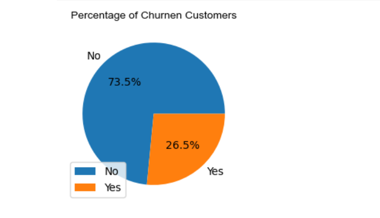

# 📊 Customer Churn Analysis

This project focuses on analyzing and predicting **Customer Churn** — determining whether a customer will continue or discontinue services based on various factors like tenure, payment methods, and monthly charges.  

The dataset used in this project is **`Customer Churn.csv`**, which provides customer-level information that can be used for **data analysis, visualization, and machine learning modeling**.

---

## 🧠 **Project Overview**

Customer churn refers to when customers stop using a company's product or service.  
This project explores customer data to:
- Identify the **key reasons behind churn**
- Build predictive models to **anticipate customer loss**
- Help organizations **improve customer retention strategies**

By leveraging **machine learning**, we can analyze churn patterns and provide valuable business insights.

---

## 📸 Screenshots

## 🛠️ **Technologies Used**

- **Python 🐍**
- **Pandas** → Data cleaning and manipulation  
- **NumPy** → Numerical computations  
- **Matplotlib & Seaborn** → Data visualization  
- **Scikit-learn** → Machine Learning models  
- **Jupyter Notebook / VS Code** → Development environment  

---

## 🌟 **Features**

✅ Data Cleaning & Handling Missing Values  
✅ Exploratory Data Analysis (EDA)  
✅ Visualization of Churn Patterns  
✅ Feature Selection & Correlation Analysis  
✅ Model Building (Decision Tree, Random Forest, Logistic Regression)  
✅ Performance Evaluation  

---

## 💻 **Prerequisites**

Before running this project, make sure you have the following installed:

- **Python 3.8+**
- **pip** (Python package manager)
- **Jupyter Notebook** or **VS Code**

## 🚀 Usage

Load the dataset:
df = pd.read_csv("data/Customer Churn.csv")
Run data preprocessing and visualization scripts.
Train and test your models to predict churn.
Analyze model accuracy and feature importance.

## 💬 Contact

Have questions, suggestions, or want to collaborate? Reach out:

- Email: [karuneshbansal84@gmail.com](mailto:karuneshbansal84@gmail.com)  
- LinkedIn: [Karunesh Bansal](https://www.linkedin.com/in/karunesh-bansal-780828380)

I look forward to hearing from you!

## 📜 License

This project is licensed under the MIT License – you’re free to use, modify, and distribute it.

## 📈 Results

Visual insights into customer behavior
Identification of top factors leading to churn
Machine Learning model capable of predicting customer churn probability

